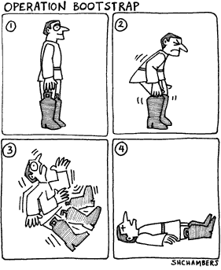

## Today

- The bootstrap
- Fixed effects

---

## Bootstrapping

- So far, we have covered methods for hypothesis testing that require information about the population distribution and/or we rely on approximations to the normal curve for the sampling distributions of sample means or sums (there is one exception for this, what is it?)

- But sometimes we don't know what the population looks like or we cannot rely on the central limit theorem to construct confidence intervals.

- In such settings, we use the bootstrap---we approximate the population distribution by using the information in the sample. 

---

 


---

- Bootstrap resampling is a methodology for approximating the sampling distribution of an estimator of interest.

- The population distribution is approximated by the empirical sample---which we then take as a `bootstrap population' from which we resample.

- We draw samples with replacement from the bootstrap population (i.e., the original empirical sample and, for each simulated sample, store the statistic of interest.

- The histogram of these statistics estimates the sampling distribution of the estimator. 

- The SD of the simulation statistics estimates the SE of the estimator.

- Key to success is that the bootstrap resampling correctly mimics the original sampling procedure.

---

## Bootstrap (mean)

Say we collected the following simple random sample from a very large population--so that we could treat the sample as i.i.d. draws from that large population.

```{r, fig.height=3, fig.width=4}
# Some data
z=c(1,6,3,3,4,4)
```

With sample mean `mean(z)`.

How can we use the bootstrap to build a confidence interval for the sample mean?

```{r}
## Bootstrap CI for mean of z
B=1000
zbar.boot=rep(NA,B)
for(i in 1:B){
    z.boot=sample(z,replace=TRUE)
    zbar.boot[i]=mean(z.boot)
}

hist(zbar.boot)
abline(v=mean(z), col="red", lwd=2)

## CI of means
quantile(zbar.boot,c(.025,.975))

```

---

But we know the sample mean and its sampling distribution well. The usefulness of the bootstrap is more clearly illustrated with a statistic we know less about (and for which we don't know the analytical formula for the SE).

*The trimmed mean.* A trimmed mean is a method of averaging that removes a small percentage/number of the largest and smallest values before calculating the mean. After removing the specified observations, the trimmed mean is found using an arithmetic averaging formula. 

---

A function to compute a trimmed mean:
```{r, fig.height=3}

trimmed.mean <- function(x,k){
    ## get order statistics
    x.ord=sort(x)
    ## remove k outliers on each end
    n=length(x)
    x.trimmed=x.ord[(k+1):(n-k)]
    ## get trimmed mean
    mean(x.trimmed)
}

# Remember z
z

trimmed.mean(z, k=1)
trimmed.mean(z, k=2)


```
---

## Bootstrap (trimmed mean)

*Goal: estimate sampling distribution and 95% CI for trimmed mean with k=3.*

k=3 means that once we obtain the sample, we will discard the 3 highest and 3 lowest values before taking the mean.

---

We will work with a new sample, which we know is a simple random sample of a population.

```{r, fig.height=4, fig.width=4}

## data:

y <- c(1.226593, 0.03184055, 0.6407651 ,0.2145773, 2.171472, 
       0.3978129, 0.5184024, 0.7989738, 1.465239, 0.1920495, 
       1.055561, 0.8558294, 1.865417, 1.035092, 1.662674, 
       0.1127212, 0.08101172, 0.1745952, 0.1075828, 0.03026473,
       0.09133911, 0.2252703, 0.4696279, 0.6739304, 0.8217542,
       0.1027049, 0.0130761, 0.1659805, 0.6633236, 0.05633055)

hist(y, breaks=10)

```

---
What is the trimmed mean of our sample?
```{r}
sample_trimmedmean <- trimmed.mean(y, k=3)
sample_trimmedmean
```

How can we estimate a CI for the trimmed mean?

---

## The bootstrap

```{r, fig.height=3}
B <- 10000
k <- 3
boot <- rep(NA, B)

for(b in 1:B){

    ## Generate a bootstrap sample by
    ## resampling from y with replacement
    y.boot <- sample(y,replace=TRUE)

    ## compute the trimmed mean from bootstrap sample
    boot[b] <- trimmed.mean(y.boot, k)
}
```

---

```{r,fig.height=3.5, fig.width=8}
## plot histogram and empirical cdf
par(mfrow=c(1,2))
hist(boot,breaks=20)
abline(v=sample_trimmedmean, col="red",lwd=3)
abline(v=quantile(boot,c(.025,.975)),col="red", lty=2) #CI

plot(ecdf(boot), xlab="trimmed mean", ylab="")
mtext(text = expression(hat(F)[n](x)), side = 2, line = 2.5)
abline(v=sample_trimmedmean, col="red",lwd=3)
abline(v=quantile(boot,c(.025,.975)),col="red", lty=2) #CI
```

How do we estimate the SE of our observed trimmed mean?

---
```{r}
#SE
sd(boot)
```

---

**We can even bootstrap a correlation...**

```{r, fig.height=4, fig.width=4.5}

LSAT <- c(576,635,578,558,666,580,555,651,661,605,575,653,545,572,594)
GPA <- c(3.9,3.8,3.3,3.5,4.0,3.6,4.0,3.5,3.9,3.6,3.6,3.2,3.2,3.3,3.4)

par(mfrow=c(1,1))
plot(LSAT,GPA, pch=16, col="blue")
```

---

```{r, fig.height=4, fig.width=4}
## calculate empirical correlation of the data
r.hat <- cor(LSAT,GPA)
r.hat
```

- We can use the bootstrap to estimate the CI of the correlation.

- Key point: we are assuming the data were i.i.d. draws (as pairs) from an underlying population.

---
```{r}
## bootstrap
B <- 10000
n <- length(LSAT)
r.boot <- rep(NA,B)

for(b in 1:B){
    ## resample indices (to keep GPA,LSAT pairs together)
    idx.boot <- sample(1:n,replace=TRUE)
    
    ## get resampled LSAT and GPA:
    LSAT.boot <- LSAT[idx.boot]
    GPA.boot <- GPA[idx.boot]
    
    ## calculate correlation of bootstrap sample
    r.boot[b] <- cor(LSAT.boot,GPA.boot)
}

```

---

```{r, fig.height=4, fig.width=4}

hist(r.boot)
abline(v=r.hat,col="red",lwd=3)

## 95% Bootstrap CI
quantile(r.boot,c(.025,.975))
abline(v=quantile(r.boot,c(.025,.975)),col="red", lty=2)

```

---

##Bootstrapping a regression model

We will use the `swiss` dataset to run a regression of `education` on `infant mortality`. We will then use the bootstrap to estimate $SE(\hat{\beta})$. Note that to use the bootstrap we need to assume a model (for the sake of the exercise, we will believe this assumption despite it is not very credible in this context).

$$ Education_{i} = \alpha + \beta * IM_{i} + \epsilon_{i} $$

Note here we are making the usual OLS assumptions. Note that we are treating \texttt{IM} as fixed.

```{r}

ols <- lm(Education ~ Infant.Mortality, data=swiss)
ols

beta_hat <- lm(Education ~ Infant.Mortality, data=swiss)$coefficients[2]
beta_hat

yhat <- ols$fitted
e <- ols$residuals

```

---

What is the mean of the residuals?
```{r}
mean(e)
```
Why is mean zero e important given the OLS model?

What is the variance of the residuals?
```{r}
mean((e-mean(e))^2)
```
Why shouldn't we use n-1 in the denominator to calculate this variance?

---

We will now use the bootstrap to estimate $SE(\hat{\beta})$.
```{r}
betaboot <- rep(NA,B)

for(b in 1:B){
    ## resample from the vector of residuals
    Y_Star <- yhat + sample(e, replace=TRUE)
    
    ## calculate beta hat of bootstrap sample
    betaboot[b] <- lm(Y_Star ~ swiss$Infant.Mortality)$coefficients[2]
}

```

---
```{r, fig.height=4, fig.width=4}

hist(betaboot)
abline(v=beta_hat, col="red", lwd=3)

## 95% Bootstrap CI
quantile(betaboot, c(.025,.975))
abline(v=quantile(betaboot,c(.025,.975)), col="red", lty=2)

```

---

We can also compare the bootstrap SE to the $SE(\hat{\beta})$ from OLS.
```{r}
sd(betaboot)

summary(ols)

```

---

## Panel data

```{r, echo=FALSE}
load("~/Dropbox/Teaching/231B_Spring2016/231b_github/section_9/country_data.Rda")
```

Panel data (also known as longitudinal or cross sectional time-series data) is a data set in which the behavior of entities are observed across time. These entities could be states, companies, individuals, countries, etc.

```{r}
head(country_data)
```

---

```{r, echo=FALSE}
library(gplots)
```

For this exercise, we will focus on the heterogeneity acroos countries:

```{r, fig.height=4, fig.width=9}
par(mfrow=c(1,2))
plotmeans(y ~ country, main="Heterogeineity across countries", data=country_data)
plotmeans(y ~ year, main="Heterogeineity across years", data=country_data)
```

```{r, echo=FALSE}
par(mfrow=c(1,1))
```

---

Regular OLS does not consider heterogeneity across groups or time...
```{r, fig.height=4}
ols <-lm(y ~ x1, data=country_data)
summary(ols)
```
---

```{r, fig.height=5, fig.width=5}
par(mfrow=c(1,1))
plot(country_data$x1, country_data$y, pch=19, xlab="x1", ylab="y")
abline(lm(country_data$y~country_data$x1),lwd=3, col="red")

```
---

## Fixed effects

Fixed-effects models help to isolate the effects of within-unit variation---though coefficients are pooled across units.

$$ Y_{it}= \alpha_i + \beta D_{it} + \epsilon_{it} $$ where there is one dummy variable (``fixed effect") $\alpha_i$ for each unit $i$ (here unit=country). This fixed-effect is a unit-specific intercept.

How will the design matrix look here?

---

```{r}

fixed.dum <-lm(y ~ x1 + factor(country) - 1, data=country_data)
summary(fixed.dum)

```

---

Each component of the factor variable (country) is absorbing the variation particular to each country. 

```{r, echo=FALSE}
library(car)
```

```{r, fig.height=6, fig.width=6}

yhat <- fixed.dum$fitted
scatterplot(yhat~country_data$x1|country_data$country,
            xlab="x1", ylab="yhat", legend.coords="topright")
abline(lm(country_data$y~country_data$x1), lwd=5, col="black")


```


